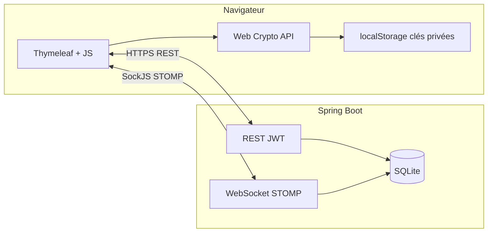

# Rapport technique — SecureChat

| Projet | SecureChat — messagerie web E2E |
|--------|----------------------------------|
| Auteur | Moustapha Ndoye |
| Document | Rapport d’architecture et de sécurité |
| Date | Avril 2026 |

---

## 1. Résumé exécutif

**SecureChat** est une application monolithique **Java 21 / Spring Boot 3.5** qui propose une messagerie instantanée dont le **contenu des messages** est chiffré **dans le navigateur** avec la **Web Crypto API**. Le serveur assure l’**identité** (comptes, JWT), le **relais** et la **persistance** des enveloppes cryptographiques (ciphertext, IV, clés enveloppées, signatures). Il ne dispose **pas** des clés privées utilisateur ni du texte en clair des messages de type CHAT, ce qui correspond au modèle **E2E au sens transport** : la confidentialité du message repose sur le client et les clés détenues localement.

---

## 2. Périmètre et objectifs

### 2.1 Objectifs

- Permettre à deux utilisateurs authentifiés d’échanger des messages **confidentiels** vis-à-vis du serveur et des intermédiaires passifs sur le transport applicatif (le serveur voit des blobs chiffrés).
- Supporter **plusieurs profils** de chiffrement (RSA + AES-GCM, ECDH + AES-GCM, variante signée ECDSA) avec **négociation** préalable.
- Fournir une **UI** de type messagerie, un **historique** rejouable après reconnexion, et des outils de **traçabilité locale** (journal terminal optionnel côté navigateur ; logs structurés côté Java).

### 2.2 Hors périmètre (limites assumées)

- **Pas** de chiffrement au repos côté SQLite des ciphertexts : la base contient les messages tels qu’expédiés ; sa protection dépend de l’OS et du déploiement.
- **Pas** de sécurité matérielle (TEE, Secure Enclave) : les clés privées sont en **localStorage**, exposées à tout script ou extension ayant accès au contexte de la page (modèle web classique).
- **Pas** de vérification d’identité hors ligne (pas de « safety numbers » type Signal) au-delà du compte applicatif.
- Les messages de **négociation** peuvent transporter des métadonnées ou clés publiques en clair dans les champs prévus par le client (comportement défini dans `app.js`).

---

## 3. Architecture logicielle

### 3.1 Vue d’ensemble

### 3.2 Couches serveur

| Couche | Rôle |
|--------|------|
| **Présentation** | `WebController` (`/` → `chat.html`), assets statiques, Swagger UI. |
| **API REST** | Auth, utilisateurs, historique, préférences de conversation. |
| **Messaging** | `ChatRelayController` : point d’entrée STOMP `/app/chat`, persistance `ChatMessageEntity`, diffusion `/topic/user-{username}`. |
| **Sécurité** | Filtre JWT HTTP, interception `CONNECT` STOMP avec validation du même JWT. |
| **Données** | JPA / Hibernate, dialect SQLite, schéma évolutif `ddl-auto=update`. |

---

## 4. Modèle de données principal

### 4.1 Utilisateur (`User`)

Stocke identifiant, hash de mot de passe, protocoles supportés, indicateur d’onboarding crypto, **key bundle** JSON (structure des **clés publiques** et métadonnées publiables). Aucune clé privée RSA/EC n’est persistée côté serveur.

### 4.2 Message (`ChatMessageEntity`)

Représente à la fois les **CHAT** chiffrés et les messages de **négociation**. Champs typiques : expéditeur, destinataire, `cipherText`, `iv`, `wrappedKey`, `senderWrappedKey`, `algorithmProfile`, `signature`, `type`, horodatage. Le champ `cipherText` est réutilisé pour porter des payloads de négociation selon le type.

### 4.3 Préférences (`UserConversationPreference`)

Suppression **logique** de conversation (`lastDeletedAt`) : filtre l’historique et les conversations actives sans effacer physiquement les enregistrements existants.

---

## 5. Flux cryptographiques (client)

### 5.1 RSA_AES_GCM

1. Génération d’une clé AES-256 éphémère par message.
2. Chiffrement du texte UTF-8 en **AES-GCM** (IV 12 octets aléatoires).
3. Enveloppe de la clé AES avec la **clé publique RSA-OAEP** du destinataire et celle de l’expéditeur (pour déchiffrer sa propre copie en historique).

### 5.2 ECDH_AES_GCM

1. Échange ou réutilisation de matériel ECDH (P-256) pour dériver une clé AES-256 partagée (côté client uniquement pour la clé brute).
2. Chiffrement AES-GCM des messages avec cette clé dérivée.

### 5.3 ECDH_AES_GCM_SIGNED

Même pipeline qu’ECDH_AES_GCM, plus une **signature ECDSA** sur une représentation canonique des champs du message (payload signé défini dans le client).

### 5.4 Négociation

Messages STOMP typés (demande, acceptation, refus, incohérence de protocole) échangés avant l’activation d’un tunnel « CHAT » avec un contact donné. Le serveur les relaie et les persiste comme les autres messages.

---

## 6. Sécurité applicative

### 6.1 Authentification

- **BCrypt** pour les mots de passe.
- **JWT** stateless ; secret configurable via `SECURECHAT_JWT_SECRET` en environnement réel.
- CORS limité par `application.cors.allowed-origins` / `SECURECHAT_CORS_ORIGINS`.

### 6.2 Intégrité de l’expéditeur (STOMP)

Le serveur **remplace** le `senderId` annoncé par le client par le nom issu du **Principal** JWT, limitant l’usurpation d’identité sur le canal messaging.

### 6.3 Règles métier

- Refus d’un message **CHAT** dont destinataire et expéditeur sont identiques (après normalisation côté serveur pour ce contrôle).

### 6.4 Journalisation

- **Java** : pour CHAT, logs du ciphertext, IV, enveloppes RSA, signature — avec rappel explicite que le **clair** et la **clé AES ECDH** ne sont pas disponibles côté serveur.
- **Navigateur** (option activable) : preuves locales (SHA-256, JSON exact, round-trip déchiffrement) — à désactiver sur poste partagé.

### 6.5 Exposition des erreurs

`server.error.include-stacktrace`, `include-message`, `include-binding-errors` désactivés pour limiter les fuites d’information en production.

---

## 7. API et temps réel (référence)

- **REST** : `/api/auth/*`, `/api/users/*`, `/api/messages/*` — détail opérationnel dans le README et annotations OpenAPI.
- **WebSocket** : SockJS `/ws`, envoi vers `/app/chat`, souscription aux topics utilisateur.
- **Documentation interactive** : Swagger UI (`/swagger-ui.html`), schéma `/v3/api-docs`.

---

## 8. Déploiement et configuration

- Fichier `application.properties` : SQLite sous `data/securechat.db`, port **8080**, durée de vie JWT.
- Variables d’environnement recommandées en production : **`SECURECHAT_JWT_SECRET`**, **`SECURECHAT_CORS_ORIGINS`**.
- Présence du répertoire `data/` pour la base SQLite.

---

## 9. Pistes d’évolution

- Chiffrement au repos de la base ou du volume disque.
- Stockage des clés privées via **WebCrypto non-extractable** + réduction de la surface localStorage où possible.
- Durcissement CORS et désactivation ou protection de Swagger en production.
- Audits de dépendances et scans OWASP périodiques.
- Tests d’intégration automatisés sur les flux STOMP et l’API.

---

## 10. Conclusion

SecureChat illustre une architecture **client-trust** pour la confidentialité des messages : le backend est conçu comme **relais et dépôt de ciphertext**, avec une séparation claire entre **sécurité transport/authentification** (serveur) et **confidentialité du contenu** (navigateur + Web Crypto). La documentation utilisateur et opérationnelle complémentaire figure dans le **README.md** à la racine du dépôt.
