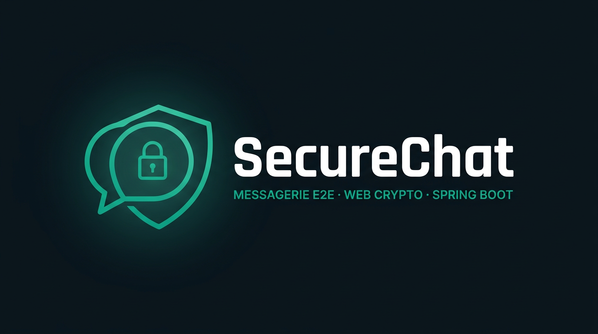

<p align="center">
  
</p>

# SecureChat

Messagerie web **chiffrée de bout en bout** : le chiffrement et le déchiffrement des messages se font **dans le navigateur** via la **Web Crypto API**. Le serveur **Spring Boot** authentifie les utilisateurs, relaie les messages **déjà chiffrés** en temps réel, les **persiste** tels quels, et expose un annuaire de **clés publiques**. Il ne reçoit **jamais** les **clés privées** ni le **texte en clair** des messages de type conversation (CHAT).

[](https://github.com/Moustapha-Ndoye-dev/SecureChat)


---

## Auteur

**Moustapha Ndoye**

---

## Fonctionnalités du projet (vue d’ensemble)

### Authentification et comptes

- **Inscription** : pseudo et mot de passe (règles minimales côté client et serveur).
- **Connexion** : obtention d’un **JWT** ; si le compte existe mais l’**onboarding cryptographique** n’est pas terminé côté serveur, l’application force l’utilisateur à finaliser la configuration des clés avant d’accéder au chat.

### Onboarding cryptographique (première utilisation ou reconfiguration)

Après connexion, l’utilisateur passe par un écran **« Initialisation sécurisée »** avec deux onglets :

1. **Algorithmes**  
   - Choix de **1 à 3 profils** parmi : **RSA_AES_GCM**, **ECDH_AES_GCM**, **ECDH_AES_GCM_SIGNED** (détails ci-dessous).  
   - **Génération locale** des paires de clés (Web Crypto), stockage des matériaux sensibles dans le navigateur (**localStorage**), puis envoi au serveur d’un **paquet de clés publiques** (key bundle) uniquement — les clés privées ne sont jamais transmises.

2. **Journalisation** (voir section dédiée)  
   - Terminal de diagnostic **local** pour tracer les opérations de chiffrement lorsque **« Journal actif »** est coché.

Tant que l’onboarding n’est pas finalisé (ou en cas de restauration / flux sans bouton « Retour au chat »), l’onglet **Journalisation** et la barre d’onglets associée peuvent être **masqués** : l’utilisateur ne bascule que sur **Algorithmes**. Une fois dans le chat, **Paramètres** réaffiche les deux onglets.

### Profils cryptographiques (côté client)

Implémentés dans `static/js/app.js`, alignés sur l’API (`ALLOWED_PROFILES` côté serveur) :

| Profil | Idée |
|--------|------|
| **RSA_AES_GCM** | Clé AES-256 par message (GCM), clé de session **enveloppée** en RSA-OAEP pour le destinataire et une copie pour l’expéditeur. |
| **ECDH_AES_GCM** | Accord **ECDH** (courbe P-256), dérivation d’une clé AES-256, messages en **AES-GCM**. |
| **ECDH_AES_GCM_SIGNED** | Même schéma qu’ECDH + **signature ECDSA** sur la charge utile transportée. |

La **négociation** du profil commun avec un contact se fait par des messages WebSocket dédiés (**demande, acceptation, refus, incompatibilité**) avant l’envoi de messages CHAT chiffrés.

### Messagerie et interface utilisateur

- **Liste de conversations** dans la barre latérale : recherche, avatar, indicateur de contact actif.
- **Nouvelle discussion** : modal listant les utilisateurs du serveur ; envoi d’une **demande de négociation** ; le fil n’apparaît de façon exploitable qu’une fois le **tunnel E2E** prêt (profil commun établi).
- **Requêtes entrantes** : modal pour **accepter** ou **ignorer** une demande de discussion.
- **Zone de chat** : bandeau E2E, zone de saisie, envoi chiffré ; pendant la négociation, un **overlay** indique l’état (dérivation du secret partagé, etc.).
- **Suppression de conversation** : confirmation ; côté serveur, **suppression logique** via préférences utilisateur (`UserConversationPreference`).
- **Paramètres** (roue dentée) : retour à l’écran de configuration (algorithmes + journalisation) avec **Retour au chat**.

### Historique et persistance

- Les messages (CHAT et messages de **négociation**) sont **enregistrés en base** pour permettre la reprise après rechargement ou reconnexion.
- **API REST** : historique **paginé** par interlocuteur, liste des **conversations actives**, **négociations en attente**, suppression logique du fil avec un contact.

### Temps réel (WebSocket / STOMP)

- Connexion **SockJS** sur `/ws`, abonnement aux topics utilisateur.
- Envoi des messages applicatifs vers `/app/chat` avec un corps JSON aligné sur `dto.ChatMessage` (champs chiffrés : `cipherText`, `iv`, enveloppes de clés, profil d’algorithme, signature éventuelle, type de message, etc.).
- Le **JWT** doit être passé dans l’en-tête **`Authorization: Bearer …`** lors du **CONNECT** STOMP.

### Journalisation (terminal crypto, local au navigateur)

L’onglet **Journalisation** héberge un faux terminal **`securechat — crypto.log`**. Ce n’est **pas** un journal serveur : tout s’affiche **uniquement dans ce navigateur**.

1. **Cocher « Journal actif »**  
   - Active la trace détaillée des **prochains envois** de messages chiffrés.  
   - L’état est mémorisé dans le **stockage local** du navigateur (`localStorage`), pour retrouver le choix aux prochaines visites.  
   - Une **LED** à côté du titre du terminal indique visuellement si le journal est actif.

2. **Sans case cochée**  
   - Le terminal peut afficher des messages d’information (par ex. invitation à activer le journal) ; les **envois ne sont pas détaillés** dans le terminal tant que « Journal actif » n’est pas activé.

3. **Contenu typique quand le journal est actif**  
   Pour chaque envoi concerné, le client peut journaliser notamment : **empreintes SHA-256** (texte clair UTF-8, ciphertext binaire, éventuellement paquet JSON réseau), **tailles**, **aperçu hex** du ciphertext, le **JSON exact** envoyé sur STOMP, et un **déchiffrement de contrôle** dans le navigateur pour vérifier le *round-trip* (le clair et les clés secrètes ne sortent jamais vers le serveur).

4. **Bouton « effacer »**  
   - Vide l’affichage du terminal (buffer) tout en gardant l’état de la case « Journal actif » selon votre choix.

5. **Avertissement sécurité**  
   - Un message console et le pied de page rappellent que ces données sont **très sensibles** : **ne pas utiliser sur un poste partagé** ; réservé à la **démonstration, l’audit pédagogique ou le débogage** sur machine personnelle.

Côté **serveur Java**, une fonction de trace optionnelle peut afficher dans la **console** des informations sur les **charges chiffrées** (sans accès au clair ni à la clé AES dérivée), pour rappeler la séparation des rôles ; le **clair** reste exclusivement côté client.

---

## Ce que fait le serveur (récapitulatif technique)

| Domaine | Rôle |
|---------|------|
| Authentification | `AuthController` : inscription, login, mots de passe **BCrypt**, JWT (`JwtService`, `JwtAuthenticationFilter`). |
| Utilisateurs & clés publiques | `UserController` : annuaire, profil `/me`, protocoles, finalisation onboarding (key bundle JSON, **publiques** seulement côté stockage). |
| Relais & persistance | `ChatRelayController` : STOMP `/app/chat`, `senderId` depuis le **Principal** JWT, refus expéditeur = destinataire pour CHAT, persistance puis diffusion sur `/topic/user-{username}`. |
| Historique | `HistoryController` : pagination, conversations actives, négociations en attente, suppression logique. |
| WebSocket | `WebSocketConfig` : SockJS `/ws`, broker `/topic`, préfixe `/app`, auth STOMP Bearer. |
| Sécurité HTTP | `SecurityConfig` : CORS, JWT stateless ; routes publiques pour auth, WebSocket et assets statiques ; le reste de `/api/*` protégé. |

---

## Stack technique

| Élément | Choix |
|---------|--------|
| Langage | Java **21** |
| Framework | Spring Boot **3.5.x** (Web MVC, Data JPA, Security, WebSocket, Thymeleaf) |
| Base de données | **SQLite** (`jdbc:sqlite:data/securechat.db`) |
| Front | **Thymeleaf** (`templates/chat.html`), **CSS** (`whatsapp.css`), **JavaScript** (`app.js`) |
| Temps réel | **SockJS** + **STOMP** (CDN dans `chat.html`) |

---

## API REST (aperçu)

| Méthode | Chemin | Rôle |
|---------|--------|------|
| POST | `/api/auth/register` | Inscription |
| POST | `/api/auth/login` | Connexion → JWT |
| GET | `/api/users` | Liste des utilisateurs (authentifié) |
| GET | `/api/users/me` | Profil courant + onboarding / protocoles |
| POST | `/api/users/protocols` | Mise à jour des protocoles sélectionnés |
| POST | `/api/users/crypto/onboarding` | Finalisation onboarding (profils + key bundle) |
| GET | `/api/messages/history` | Historique avec un utilisateur (pagination) |
| GET | `/api/messages/active-chats` | Contacts avec conversation active |
| GET | `/api/messages/pending-negotiations` | Demandes de négociation en attente |
| DELETE | `/api/messages/conversation/{withUser}` | Suppression logique du fil |

---

## Configuration

Fichier `src/main/resources/application.properties` :

- **SQLite** : `spring.datasource.url=jdbc:sqlite:data/securechat.db`
- **JWT** : secret configurable — en production, préférer la variable d’environnement **`SECURECHAT_JWT_SECRET`**
- **CORS** : `application.cors.allowed-origins` — surcharge possible avec **`SECURECHAT_CORS_ORIGINS`**
- **Port** : `8080` par défaut

---

## Démarrage

1. Cloner le dépôt et se placer à la racine du projet.
2. Le dossier **`data/`** est versionné (`.gitkeep`) ; le fichier **SQLite** `data/securechat.db` est ignoré par Git et sera créé au premier démarrage.
3. Lancer :

   ```bash
   ./mvnw spring-boot:run
   ```

4. Ouvrir [http://localhost:8080](http://localhost:8080), créer des comptes, terminer l’onboarding crypto sur chaque navigateur, puis tester les conversations, la négociation et, si besoin, le **Journal actif** dans **Paramètres → Journalisation**.

---

## Structure du dépôt

```text
data/.gitkeep                # Dossier SQLite versionné (fichiers .db ignorés)
src/main/java/sn/ism/cdsd/api/
├── SecureChatApiApplication.java
├── config/           # SecurityConfig, JwtService, WebSocketConfig, CORS, SQLite, exceptions
├── controller/       # AuthController, UserController, HistoryController, ChatRelayController, WebController
├── dto/              # ChatMessage, auth, onboarding, profil
├── model/            # User, ChatMessageEntity, UserConversationPreference
└── repository/       # JPA

src/main/resources/
├── application.properties
├── templates/chat.html
└── static/
    ├── css/whatsapp.css
    └── js/app.js
```
